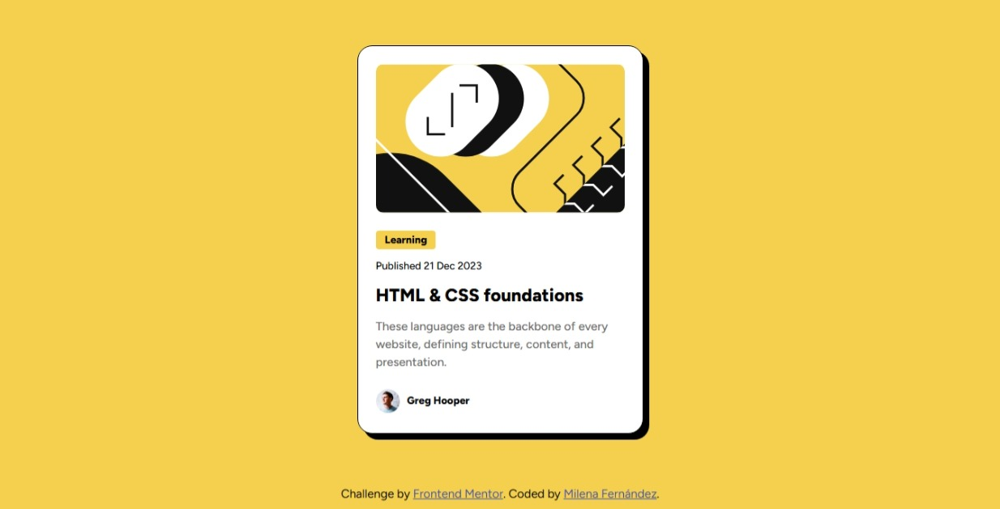

# Frontend Mentor - Blog preview card solution

This is a solution to the [Blog preview card challenge on Frontend Mentor](https://www.frontendmentor.io/challenges/blog-preview-card-ckPaj01IcS). Frontend Mentor challenges help you improve your coding skills by building realistic projects. 

## Table of contents

- [Overview](#overview)
  - [The challenge](#the-challenge)
  - [Screenshot](#screenshot)
  - [Links](#links)
- [My process](#my-process)
  - [Built with](#built-with)
  - [Continued development](#continued-development)
- [Author](#author)

## Overview

### The challenge

Users should be able to:

- See hover and focus states for all interactive elements on the page

### Screenshot

### Links

- Solution URL: [Solution URL here]([https://your-solution-url.com](https://github.com/LenaMilena/Blog-preview-card.git)
- Live Site URL: [Live site URL here]([https://your-live-site-url.com](https://lenamilena.github.io/Blog-preview-card/)

## My process

### Built with

- Semantic HTML5 markup
- CSS custom properties
- Flexbox
- Mobile-first workflow
- Hover and focus states

### Continued development

In future projects, I want to keep improving my CSS layout skills, especially by learning CSS Grid for more complex responsive designs.

## Author

- Frontend Mentor - [@LenaMilena](https://www.frontendmentor.io/profile/lenaMilena)

